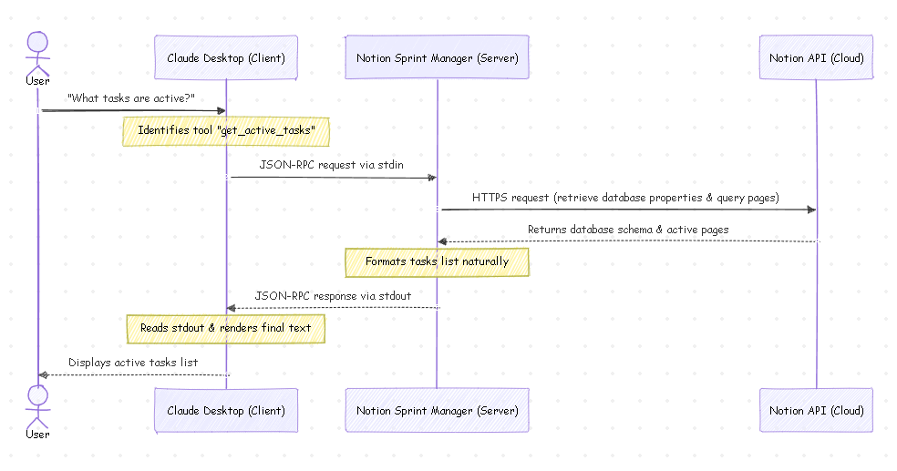

# How We Built a Dynamic Notion Sprint Backlog Manager using Model Context Protocol (MCP) and Claude Desktop

*Break free from hardcoded integrations and empower your AI assistant to manage your Notion workspace dynamically using TypeScript, the MCP SDK, and standard I/O.*

---

As AI agents transition from simple conversational assistants to active partners in our development workflows, a critical bottleneck has emerged: **how do they interact with our data?** 

Every application has a custom API, and every model vendor expects functions to be defined in a specific format. Writing custom glue code for every tool-agent combination is slow, fragile, and doesn't scale.

Enter the **Model Context Protocol (MCP)**, an open standard introduced by Anthropic. MCP defines a uniform protocol for AI clients (like Claude Desktop, Cursor, or VS Code) to securely connect to external tools, databases, and APIs.

In this article, we'll walk through how we built **Notion Sprint Manager**, a custom MCP server written in TypeScript. This server allows Claude to read, create, and update development tasks in your Notion workspace. More importantly, we’ll explain how we solved one of the most frustrating aspects of building Notion integrations: **handling custom database schemas dynamically.**

🔗 **GitHub Repository**: [JMedina255/mcp-notion-server](https://github.com/JMedina255/mcp-notion-server)

---

## The Architecture: How MCP Works via `stdio`

Unlike traditional web-based integrations that rely on persistent WebSockets or polling HTTP endpoints, local MCP servers communicate with AI clients via simple standard input and output (**`stdio`**).

### Communication Flow Diagram

Here is how the data flows between the user, Claude, your local server, and Notion:



### The Step-by-Step Flow:
1. **The Client (Claude Desktop)** spawns the MCP server as a background Node.js process.
2. When the user asks: *"What tasks do I have in my backlog?"*, Claude identifies that it needs the `get_active_tasks` tool.
3. Claude sends a standardized JSON-RPC request to the server's standard input (`stdin`).
4. **The Server** receives the request, queries the Notion API, parses the response, and writes a JSON-RPC response containing the task text back to the server's standard output (`stdout`).
5. Claude reads the output, formats it, and presents it naturally to the user.

> ⚠️ **The Golden Rule of Stdio MCP Servers**:
> Because the JSON-RPC messages flow through `stdout`, any console log statement (like `console.log("Server started!")`) will corrupt the stream and crash the connection. **All diagnostic logs, warnings, and errors must be explicitly redirected to `console.error`**, which prints to `stderr` and is safely captured by Claude's debug logs.

---

## The Core Challenge: Notion's Schema Flexibility

Most Notion integration tutorials assume a rigid database structure: a text property named exactly `Name`, a select property named exactly `Status`, and a date property named exactly `Due Date`. 

But in the real world, workspaces are highly customized. Teams change property names (e.g., calling the task title `Task Name` or `Título`, renaming status to `State` or `estado`, or prioritizing using custom options). Writing an integration with hardcoded property names means that the moment a user tweaks their Notion workspace, the integration breaks.

To solve this, our MCP server implements **Dynamic Schema Discovery**.

### Implementing Dynamic Property Resolution

At the start of every tool execution, the server calls `resolveDatabaseProperties`. This helper retrieves the database's metadata from Notion and inspects its schema at runtime. 

By analyzing the property *types* and searching for common naming patterns, the server dynamically locates the appropriate columns:

```typescript

async function resolveDatabaseProperties(dbId: string) {
  const db = await notion.databases.retrieve({ database_id: dbId }) as any;
  const props = db.properties || {};

  // 1. Locate the Title property (always has type 'title')
  const nameKey = Object.keys(props).find(
    key => props[key].type === 'title'
  ) || 'Name';

  // 2. Locate Status (type 'status' or a select property named 'status' or 'estado')
  const statusKey = Object.keys(props).find(
    key => props[key].type === 'status'
  ) || Object.keys(props).find(
    key => (key.toLowerCase() === 'status' || key.toLowerCase() === 'estado') && props[key].type === 'select'
  ) || 'Status';
  const statusType = props[statusKey]?.type || 'status';

  // 3. Locate Priority (select or status property named priority/prioridad)
  const priorityKey = Object.keys(props).find(
    key => (key.toLowerCase() === 'priority' || key.toLowerCase() === 'prioridad') && 
           (props[key].type === 'select' || props[key].type === 'status')
  ) || Object.keys(props).find(
    key => props[key].type === 'select' && 
      Array.isArray(props[key].select?.options) && 
      props[key].select.options.some((opt: any) => 
        ['high', 'medium', 'low', 'alta', 'media', 'baja'].includes(opt.name.toLowerCase())
      )
  ) || 'Priority';
  const priorityType = props[priorityKey]?.type || 'select';

  // 4. Locate Due Date (a date property, prioritizing names like due date, fecha, entrega)
  const dueDateKey = Object.keys(props).find(
    key => props[key].type === 'date' && 
      ['due date', 'due_date', 'fecha', 'vencimiento', 'entrega', 'fecha de entrega', 'due'].some(
        term => key.toLowerCase().includes(term)
      )
  ) || Object.keys(props).find(
    key => props[key].type === 'date'
  ) || 'Due Date';

  return { nameKey, statusKey, statusType, priorityKey, priorityType, dueDateKey };
}
```

By mapping the columns dynamically, the server can adapt on the fly:
* If your status column is named `"estado"` and is a **Select** property, it resolves it.
* If it is a modern Notion **Status** property, it adjusts the payload structure dynamically.
* The API payload is constructed using the resolved keys (`keys.statusKey`, `keys.priorityKey`) and types (`keys.statusType`), avoiding validation schema errors.

---

## Writing the MCP Server

We initialize the MCP server using the official `@modelcontextprotocol/sdk`. We define two main interaction schemas:
1. **`ListToolsRequestSchema`**: Declares our tools and their parameters to the AI.
2. **`CallToolRequestSchema`**: Executes the requested tool logic.

Here is how we expose the `add_task_to_backlog` tool:

```typescript

import { Server } from '@modelcontextprotocol/sdk/server/index.js';
import { StdioServerTransport } from '@modelcontextprotocol/sdk/server/stdio.js';
import { ListToolsRequestSchema, CallToolRequestSchema } from '@modelcontextprotocol/sdk/types.js';
import { Client } from '@notionhq/client';

const server = new Server(
  { name: 'notion-sprint-manager', version: '1.0.0' },
  { capabilities: { tools: {} } }
);

// Register list of tools
server.setRequestHandler(ListToolsRequestSchema, async () => {
  return {
    tools: [
      {
        name: 'add_task_to_backlog',
        description: 'Add a new task to the backlog in the Notion database.',
        inputSchema: {
          type: 'object',
          properties: {
            name: { type: 'string', description: 'The name/title of the task.' },
            status: { type: 'string', description: 'The status of the task (e.g. Backlog, Todo, In Progress).' },
            priority: { type: 'string', description: 'The priority of the task (e.g. High, Medium, Low).' },
            due_date: { type: 'string', description: 'The due date in YYYY-MM-DD format.' },
          },
          required: ['name'],
        },
      },
      // ...other tools like get_active_tasks and update_task_status
    ],
  };
});
```

### Implementing Dynamic Payload Construction

When creating a new page in Notion, the server dynamically structures the database parameters based on the detected types. If the status field is a `"status"` property, it formats it as `{ status: { name: value } }`. If it's a `"select"` property, it shifts to `{ select: { name: value } }`.

```typescript

server.setRequestHandler(CallToolRequestSchema, async (request) => {
  const { name, arguments: args } = request.params;
  const keys = await resolveDatabaseProperties(databaseId);

  if (name === 'add_task_to_backlog') {
    const taskArgs = args as { name: string; status?: string; priority?: string; due_date?: string };
    
    const properties: Record<string, any> = {
      [keys.nameKey]: {
        title: [{ text: { content: taskArgs.name } }],
      },
    };

    // Dynamically choose between 'status' and 'select' properties
    if (taskArgs.status) {
      properties[keys.statusKey] = keys.statusType === 'status' 
        ? { status: { name: taskArgs.status } } 
        : { select: { name: taskArgs.status } };
    }

    if (taskArgs.priority) {
      properties[keys.priorityKey] = keys.priorityType === 'status' 
        ? { status: { name: taskArgs.priority } } 
        : { select: { name: taskArgs.priority } };
    }

    if (taskArgs.due_date) {
      properties[keys.dueDateKey] = {
        date: { start: taskArgs.due_date },
      };
    }

    const newPage = await notion.pages.create({
      parent: { database_id: databaseId },
      properties,
    });

    return {
      content: [{ type: 'text', text: `Successfully created task "${taskArgs.name}" with ID: ${newPage.id}` }],
    };
  }
  // ...other tools handler
});
```

---

## Setting Up Locally

Want to try this out yourself? Here's how to spin it up in 5 minutes.

### 1. Clone & Install Dependencies
First, clone the repository and install the project dependencies:
```bash
git clone https://github.com/JMedina255/mcp-notion-server.git
cd mcp-notion-server
npm install
```

### 2. Configure Notion Credentials
Create a `.env` file in the root of the directory:
```env

NOTION_TOKEN=your_notion_integration_token_here
NOTION_DATABASE_ID=your_notion_database_id_here
```
> 💡 *Need a token?* Go to [notion.so/my-integrations](https://www.notion.so/my-integrations) to create an integration. Make sure you share the target database with your integration in the Notion UI!

### 3. Build the Project
Compile the TypeScript code to optimized JavaScript:
```bash
npm run build
```
This output is saved to `dist/index.js`.

---

## Integrating with Claude Desktop

To tell Claude Desktop where to find our server, we must register it in the configuration file.

### Finding the Configuration Path
Depending on your installation type on Windows, open the config folder:
* **Standard installation**: `%APPDATA%\Claude\claude_desktop_config.json`
* **Microsoft Store / MSIX version**: `%LOCALAPPDATA%\Packages\Claude_pzs8sxrjxfjjc\LocalCache\Roaming\Claude\claude_desktop_config.json`

### Adding the Configuration
Add your server config under the `"mcpServers"` object. Make sure to use **absolute paths** and forward slashes `/` (or escaped double-backslashes `\\`) to prevent JSON parsing issues on Windows:

```json

{
  "mcpServers": {
    "notion-sprint-manager": {
      "command": "node",
      "args": [
        "C:/Users/YourUsername/Desktop/mcp-notion-server/dist/index.js"
      ],
      "env": {
        "NOTION_TOKEN": "ntn_your_actual_token_here",
        "NOTION_DATABASE_ID": "your_database_uuid_here"
      }
    }
  }
}
```

*Note: If Claude fails to find the `node` environment variable, replace `"command": "node"` with the absolute path to your node executable, e.g. `"C:/Program Files/nodejs/node.exe"`.*

Restart Claude Desktop completely (quit from the system tray and open it again), and you will see a plug icon 🔌 appear in the chat text box, signaling that the server is successfully connected!

---

## Real-world Usage: Chatting with Notion

Once connected, you can interact with your Notion workspace in natural language. Try prompts like:

* 📥 *“Which tasks are currently in progress in my backlog?”*
* ➕ *“Add a new task named 'Implement Unit Tests' with High priority and set the due date to tomorrow.”*
* 🔄 *“Move the task titled 'Refactor login controller' to Done.”*

Claude will translate your intent into structured JSON-RPC calls, send them to the server, invoke the Notion API, and give you a natural confirmation directly in the chat interface.

---

## Future Enhancements: Moving to the Cloud

While running the MCP server locally via standard I/O is incredible for local setups and prototyping, you might want to share this server with your team or run it on cloud IDEs.

MCP supports remote connections using **Server-Sent Events (SSE)**. You can easily containerize this Node.js application and deploy it to:
- **Google Cloud Run**: Ideal for low-cost, containerized hosting that scales to zero.
- **Cloudflare Workers**: High-performance, low-latency edge deployment.
- **Composio / Leanware**: Modern infrastructure services designed to manage and route MCP tools for production AI agents.

By deploying the server remotely, your custom AI agents running in the cloud can retrieve live data from Notion just as easily as they did on your local machine.

---

## Wrap Up

The Model Context Protocol makes AI tool integration structured and standard. By decoupling the interface from hardcoded schemas and resolving properties dynamically, our **Notion Sprint Manager** server remains resilient to changes, providing a robust workflow assistant for developers.

Try cloning the repo, hook it up to your workspace, and let us know what you think! 🚀

*Have any questions, or built a cool extension? Open an issue or submit a PR on [GitHub](https://github.com/JMedina255/mcp-notion-server).*
