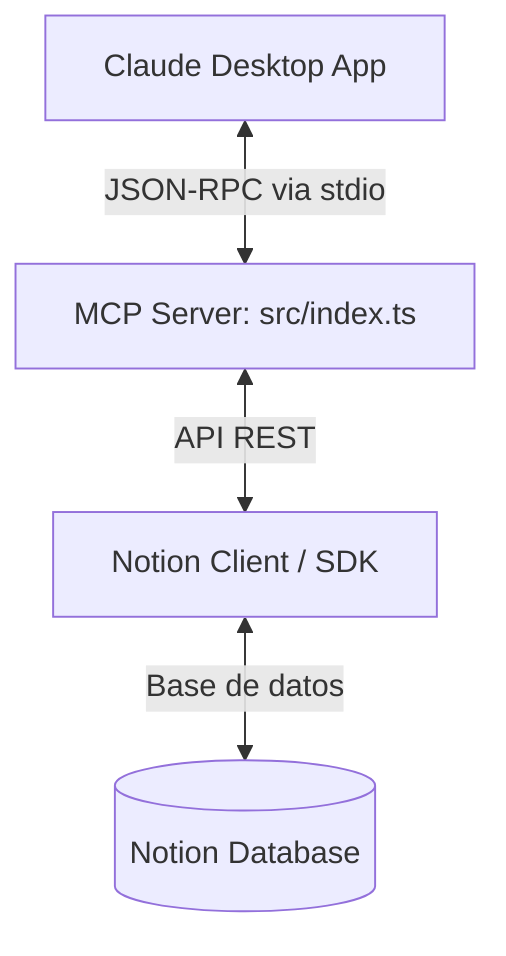

# Resumen Técnico: Servidor MCP Notion Sprint Manager

Este documento detalla la arquitectura, las decisiones de diseño y la resolución de problemas durante el desarrollo del servidor MCP para la gestión de Sprints en Notion. Este resumen servirá de base técnica para redactar el artículo final.

---

## 1. Contexto: ¿Qué es MCP?
El **Model Context Protocol (MCP)** es un protocolo abierto diseñado por Anthropic que estandariza la manera en que los modelos de lenguaje (LLMs) se conectan de forma segura a fuentes de datos y herramientas locales. Actúa como una capa intermedia estable y estructurada (usando JSON-RPC 2.0 sobre `stdio` o `SSE`) para que aplicaciones cliente como Claude Desktop puedan leer información o ejecutar acciones en servicios externos de manera segura.

---

## 2. Arquitectura del Servidor
El servidor está desarrollado en **TypeScript** bajo Node.js y se estructura en tres componentes clave:



### Tecnologías Utilizadas
* **TypeScript & Node.js**: Con soporte para ES2022 y NodeNext.
* **@modelcontextprotocol/sdk**: SDK oficial para la creación de servidores y definición de herramientas.
* **@notionhq/client (v5.22.0)**: Cliente de Node oficial para interactuar con la API de Notion.
* **dotenv**: Carga y gestión de variables de entorno para tokens y IDs.

---

## 3. Retos Técnicos Superados (El Valor Técnico)

### A. Corrupción del Canal de Comunicación (`stdout`)
* **Problema**: El protocolo MCP utiliza la entrada y salida estándar (`stdin`/`stdout`) para intercambiar mensajes de JSON-RPC. Cualquier librería que imprima texto no estructurado en `stdout` rompe el flujo e impide que Claude Desktop procese las respuestas, arrojando errores como *Unexpected token '◇' is not valid JSON*.
* **Solución**: 
  1. Redirigimos todos los logs de diagnóstico o errores a `console.error` (que utiliza `stderr`), el cual es ignorado por el analizador JSON del cliente MCP pero registrado en los logs del sistema.
  2. Configuramos `dotenv` de forma silenciosa para evitar que imprima metadatos en la consola al arrancar:
     ```typescript
     dotenv.config({ quiet: true });
     ```

### B. Adaptación a la versión v5.22.0 del SDK de Notion
* **Problema**: En la versión instalada (`v5.22.0`), el SDK de Notion maneja las bases de datos de forma sincronizada con **Data Sources** (`notion.dataSources`). La clásica consulta directa de consulta de base de datos (`notion.databases.query`) no estaba expuesta de forma estándar en el tipado.
* **Solución**: 
  1. Resolvimos dinámicamente las propiedades de la base de datos obteniendo primero el ID de origen de datos asociado (`db.data_sources[0].id`).
  2. Ejecutamos las consultas a través de `notion.dataSources.query` con la opción `result_type: 'page'`, permitiéndonos consultar y filtrar los elementos de la base de datos de forma nativa.

### C. Mapeo Dinámico y Agnóstico del Esquema
* **Problema**: Las propiedades de Estado y Prioridad en Notion pueden definirse indistintamente como campos de tipo `status` o `select` según el usuario. Hardcodear los payloads generaría errores de esquema.
* **Solución**: Implementamos una función de resolución dinámica (`resolveDatabaseProperties`) que consulta el esquema del origen de datos, detecta los tipos reales de las propiedades y construye el payload correcto para cada tipo sobre la marcha.

### D. Virtualización y Sandbox en Claude Desktop (Versión Microsoft Store/MSIX)
* **Problema**: El usuario tenía instalada la versión empaquetada de Claude Desktop de la Microsoft Store. Windows ejecuta estas aplicaciones en un contenedor virtualizado de seguridad, aislando su sistema de archivos. Por ende, Claude no leía la configuración en la ruta típica `%APPDATA%\Claude\claude_desktop_config.json`.
* **Solución**: Ubicamos la carpeta virtualizada del contenedor de Claude en:
  `C:\Users\Admin\AppData\Local\Packages\Claude_pzs8sxrjxfjjc\LocalCache\Roaming\Claude\`
  Escribimos la configuración en esa ruta y definimos la ruta absoluta de Node.exe para asegurar que Claude pueda invocarlo en su entorno restringido.

---

## 4. Configuración Final del Cliente
La conexión entre Claude y el servidor se realiza mediante el siguiente bloque en `claude_desktop_config.json`:

```json
{
  "mcpServers": {
    "notion-sprint-manager": {
      "command": "C:/Program Files/nodejs/node.exe",
      "args": [
        "C:/Users/Admin/Desktop/LabsNegocios/mcp-notion-server/dist/index.js"
      ],
      "env": {
        "NOTION_TOKEN": "ntn_...",
        "NOTION_DATABASE_ID": "391d..."
      }
    }
  }
}
```

---

## 5. Próximos Pasos: El Artículo
Con esta base técnica, el artículo estructurará el viaje de la siguiente forma:
1. **Introducción**: El auge de la IA local y cómo MCP elimina las barreras de integración.
2. **El Problema**: El dolor de cabeza de saltar entre tu chat de IA y tus herramientas de gestión de proyectos (Notion).
3. **El Servidor**: Cómo creamos un puente bidireccional en TypeScript.
4. **Lecciones de Trinchera**: Qué pasa cuando los canales de log se corrompen o cuando Windows sandboxea tus apps de escritorio.
5. **Conclusión**: El futuro del desarrollo ágil asistido por agentes.
